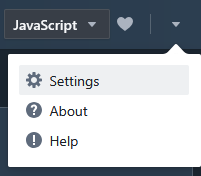
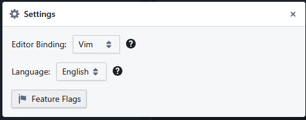
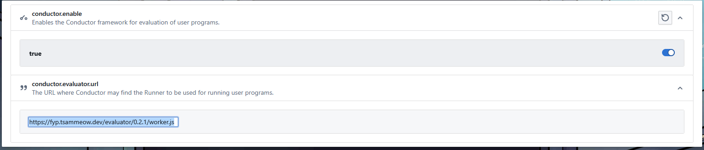

## Install Yarn

```shell
npm install --global yarn
```

## Wrong version of Yarn on windows

On elevated terminal:

```shell
corepack enable
```

## Getting started

```shell
yarn install
yarn generate-parser
yarn build
node main.js
```

## Importing `index.js` to sourceacademy playground

1. Go to <https://sourceacademy.org/playground>

2. Select settings from dropdown



3. Select Feature Flags



4. Set `conductor.enable` to true and `conductor.evaluator.url` to the deployed `index.js` file URL



## Install rollup

```shell
npm install --global rollup
```

## Note

When building for iife, rollup's `typescript` module thinks that parser source files are in `parser/src` and not `parser/`, so import statements need to follow accordingly.
